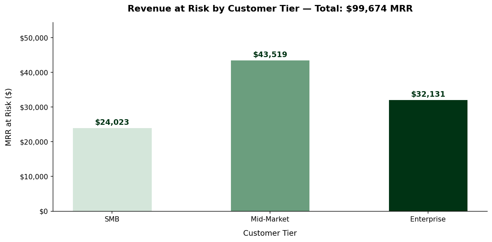
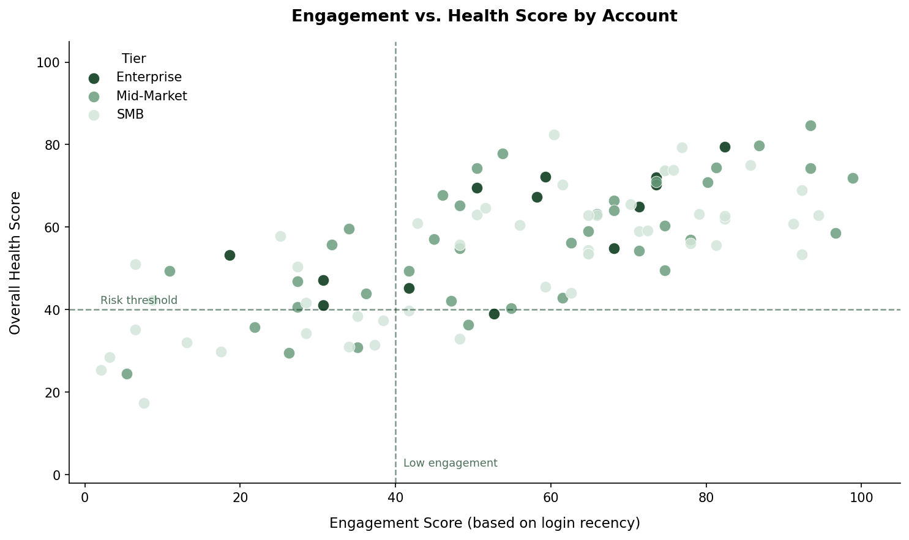

# Revenue Bridge Analytics

**Strategic Risk Framework: Cross-Functional Data Integration for Churn Mitigation**

---

## [ 01. EXECUTIVE SUMMARY ]

In high-growth B2B SaaS, the most dangerous churn is **Silent Churn** -- high-value enterprise accounts that stop engaging long before they cancel. By the time a cancellation request arrives, the decision has usually been made weeks or months earlier.

This project is a technical demonstration of a **Revenue Bridge**: a Python pipeline that merges siloed data from Sales (CRM), Support (Service Cloud), and Product (Usage) to surface revenue at risk before it walks out the door.

The output is a prioritized intervention list for CS and executive teams -- not a dashboard to admire, but a list of accounts to call on Monday morning.

---

## [ 02. THE OPERATIONAL PROBLEM ]

Most B2B SaaS organizations run on three separate data systems that rarely talk to each other:

- **CRM (Sales):** Knows contract value and renewal dates. Blind to daily account health.
- **Support (Service Cloud):** Tracks ticket volume and resolution time. Has no view of account revenue or strategic importance.
- **Product (Usage):** Monitors feature adoption and login frequency. Has no customer sentiment or billing context.

The result is a leadership blind spot. A $14,000 MRR account can be silently disengaging -- filing more tickets, logging in less, adopting fewer features -- and no single team has the full picture to act.

**Project Sentinel bridges these gaps** by performing a three-way data join and computing a weighted **Customer Health Score** per account, then ranking accounts by the intersection of revenue size and health deterioration.

---

## [ 03. TECHNICAL ARCHITECTURE ]

The pipeline runs in three stages:

### Stage 1 -- Data Generation (`data_generator.py`)
Simulates a 100-account B2B SaaS environment with realistic company names and messy, siloed datasets (CSV) to mirror a real-world tech stack. Each dataset lives in isolation, as it would in production.

### Stage 2 -- Algorithmic Analysis (`revenue_analysis.py`)
A Python/Pandas engine that performs a three-way SQL-style join across the three datasets and applies a weighted health algorithm:

| Signal | Weight | Source | Rationale |
|---|---|---|---|
| **Engagement** | 40% | Product/Usage | Login recency is the strongest leading indicator of churn |
| **Sentiment** | 30% | Support tickets | Tone and volume of support interactions signal satisfaction |
| **Adoption** | 30% | Product/Usage | Feature utilization relative to contract tier shows perceived value |

> **Note on sentiment scoring:** Sentiment is calculated using a rule-based keyword model applied to support ticket text. This approach is transparent, reproducible, and requires no external API dependency. A production version of this system would replace this with a fine-tuned classification model or LLM-based scoring.

### Stage 3 -- Strategic Output (`high_priority_risk_report.csv`)
The final artifact. A ranked list of accounts sitting at the critical intersection of high revenue and low health, with a recommended strategic action per account. Built for the CS or executive team to action immediately.

---

## [ 04. SAMPLE OUTPUT: HIGH-PRIORITY INTERVENTION LIST ]

The engine surfaces accounts at the **critical intersection: high revenue + deteriorating health.**

For each run, the pipeline analyzes 100 synthetic accounts across SMB, Mid-Market, and Enterprise tiers and produces a ranked intervention list. The accounts below are representative examples from a sample run -- actual output varies based on the data.

| Account | Tier | MRR | Health Score | Recommended Action |
|---|---|---|---|---|
| **Meridian Technologies** | Mid-Market | $14,863 | 40.8 / 100 | Immediate Executive Outreach |
| **Northgate Financial** | Mid-Market | $14,836 | 32.4 / 100 | Immediate Executive Outreach |
| **Crestview Solutions** | Mid-Market | $14,138 | 27.0 / 100 | Technical Product Audit |
| **Harlow Logistics** | Enterprise | $13,704 | 25.6 / 100 | Success Team Wellness Check |
| **Pinnacle Analytics** | Mid-Market | $13,160 | 38.1 / 100 | Success Team Wellness Check |

The pipeline also generates three charts (see Section 05) showing the full portfolio health distribution, revenue at risk by tier, and engagement vs. health score across all accounts.

---

## [ 05. VISUALIZATIONS ]

### Health Score Distribution Across Portfolio


### Revenue at Risk by Customer Tier


### Engagement vs. Health Score (Scatter)


---

## [ 06. BUSINESS IMPACT ]

- **Visibility:** Instantly quantifies over **$99K in potential churn risk** previously hidden across three disconnected systems.
- **Speed:** Transforms hours of manual cross-referencing between CRM, Support, and Usage logs into an automated, repeatable pipeline.
- **Proactivity:** Flags accounts like **Northgate Financial** ($14.8K MRR, health score 32.4) for intervention based on declining signals -- before a cancellation request is ever filed.
- **Prioritization:** Gives CS and executive teams a clear, ranked list with recommended actions. No interpretation required.

---

## [ 07. HOW TO RUN ]

```bash
# Install dependencies
pip install pandas numpy matplotlib

# Generate synthetic data
python data_generator.py

# Run the analysis pipeline
python revenue_analysis.py

# Output: high_priority_risk_report.csv + charts in /outputs
```

---

## [ 08. WHAT I WOULD BUILD NEXT ]

- **Trend layer:** Track health scores over time, not just point-in-time. Flag accounts where scores are declining week-over-week even if the absolute score is still healthy.
- **LLM-powered ticket summarization:** Replace rule-based sentiment scoring with a Claude API call that summarizes the tone and content of recent support interactions per account.
- **Automated alerting:** A lightweight scheduler (cron or Zapier) that runs the pipeline weekly and posts the top five at-risk accounts to a Slack channel.
- **Streamlit dashboard:** An interactive front-end that lets CS managers filter by tier, date range, and health threshold without touching the code.

---

**Status:** Functional / Documented
**Stack:** Python, Pandas, NumPy, Matplotlib
**Author:** Mohamed Bah | [LinkedIn](https://www.linkedin.com/in/bah-007700/) | [GitHub](https://github.com/Moezusb)
