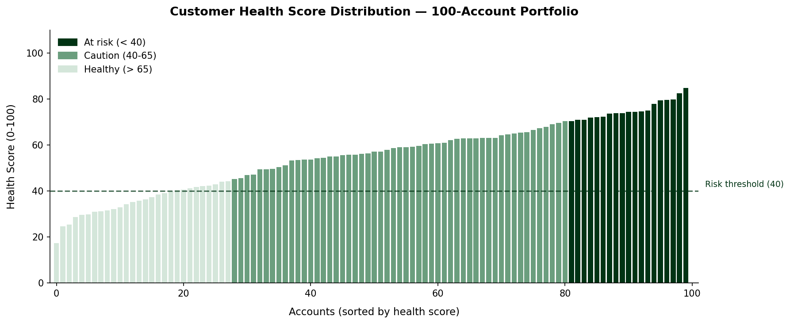

# Revenue Bridge Analytics

**Strategic Risk Framework: Cross-Functional Data Integration for Churn Mitigation**

---

## [ 01. EXECUTIVE SUMMARY ]

In high-growth B2B SaaS, the most dangerous churn is **Silent Churn** -- high-value enterprise accounts that stop engaging long before they cancel. By the time a cancellation request arrives, the decision has usually been made weeks or months earlier.

This project is a technical demonstration of a **Revenue Bridge**: a Python pipeline that merges siloed data from Sales (CRM), Support (Service Cloud), and Product (Usage) to surface revenue at risk before it walks out the door.

The output is a prioritized intervention list for CS and executive teams -- not a dashboard to admire, but a list of accounts to call on Monday morning.

---

## [ 02. THE OPERATIONAL PROBLEM ]

Most B2B SaaS organizations run on three separate data systems that rarely talk to each other:

- **CRM (Sales):** Knows contract value and renewal dates. Blind to daily account health.
- **Support (Service Cloud):** Tracks ticket volume and resolution time. Has no view of account revenue or strategic importance.
- **Product (Usage):** Monitors feature adoption and login frequency. Has no customer sentiment or billing context.

The result is a leadership blind spot. A $10,000 MRR account can be silently disengaging -- filing more tickets, logging in less, adopting fewer features -- and no single team has the full picture to act.

**Revenue Bridge** solves this by performing a three-way data join and computing a weighted **Customer Health Score** per account, then ranking accounts by the intersection of revenue size and health deterioration.

---

## [ 03. TECHNICAL ARCHITECTURE ]

The pipeline runs in three stages:

### Stage 1 -- Data Generation (`data_generator.py`)
Simulates a 100-account B2B SaaS environment with realistic company names and messy, siloed datasets to mirror a real-world tech stack. Each dataset lives in isolation, as it would in production. Fixed random seed for full reproducibility.

### Stage 2 -- Algorithmic Analysis (`revenue_analysis.py`)
A Python/Pandas engine that performs a three-way SQL-style join across the three datasets and applies a weighted health algorithm:

| Signal | Weight | Source | Rationale |
|---|---|---|---|
| **Engagement** | 40% | Product/Usage | Login recency is the strongest leading indicator of churn |
| **Sentiment** | 30% | Support tickets | Tone and volume of support interactions signal satisfaction |
| **Adoption** | 30% | Product/Usage | Feature utilization relative to contract tier shows perceived value |

> **Note on sentiment scoring:** Sentiment is calculated using a rule-based model applied to support ticket data. This approach is transparent, reproducible, and requires no external API dependency. A production version would replace this with a fine-tuned classifier or LLM-based scoring via Claude API.

### Stage 3 -- Strategic Output (`high_priority_risk_report.csv`)
The final artifact. A ranked list of accounts at the critical intersection of high revenue and low health, with a recommended strategic action per account and risk classification (Critical, At Risk, Watch, Healthy).

---

## [ 04. SAMPLE OUTPUT: HIGH-PRIORITY INTERVENTION LIST ]

The engine surfaces accounts at the **critical intersection: deteriorating health + revenue exposure.**

| Account | Tier | MRR | Health Score | Recommended Action |
|---|---|---|---|---|
| **Pinecrest Technologies** | SMB | $2,842 | 18.1 / 100 | Immediate CS Outreach |
| **Shoreline Advisory** | Mid-Market | $10,598 | 18.7 / 100 | Immediate CS Outreach |
| **Sapphire Systems** | SMB | $2,450 | 20.7 / 100 | Immediate CS Outreach |
| **Valleyfield Analytics** | Mid-Market | $4,363 | 27.6 / 100 | Immediate CS Outreach |
| **Millstone Group** | SMB | $1,467 | 29.9 / 100 | Immediate CS Outreach |

*Output from a sample run. Results vary based on synthetic data generation.*

---

## [ 05. VISUALIZATIONS ]

### Portfolio Analysis -- Health Distribution, Revenue at Risk, Engagement vs. Health


---

## [ 06. BUSINESS IMPACT ]

- **Visibility:** Instantly quantifies **$438,547 in revenue at risk** (52.8% of total portfolio MRR) previously hidden across three disconnected systems.
- **Speed:** Transforms hours of manual cross-referencing between CRM, Support, and Usage logs into an automated, repeatable pipeline.
- **Proactivity:** Flags accounts like **Shoreline Advisory** ($10.6K MRR, health score 18.7) for intervention based on declining signals -- before a cancellation request is ever filed.
- **Prioritization:** Gives CS and executive teams a clear, ranked list with recommended actions and risk classifications. No interpretation required.

---

## [ 07. HOW TO RUN ]
```bash
# Install dependencies
pip install pandas numpy matplotlib

# Generate synthetic data
python data_generator.py

# Run the analysis pipeline
python revenue_analysis.py

# Outputs:
#   high_priority_risk_report.csv -- full ranked intervention list
#   outputs/health_score_distribution.png -- three-panel portfolio analysis
```

No local setup required -- runs directly in [Google Colab](https://colab.research.google.com) or GitHub Codespaces.

---

## [ 08. WHAT I WOULD BUILD NEXT ]

- **Trend layer:** Track health scores over time, not just point-in-time. Flag accounts where scores are declining week-over-week even if the absolute score is still healthy.
- **LLM-powered ticket summarization:** Replace rule-based sentiment scoring with a Claude API call that summarizes the tone and content of recent support interactions per account.
- **Automated alerting:** A lightweight scheduler (cron or Zapier) that runs the pipeline weekly and posts the top five at-risk accounts to a Slack channel.
- **Streamlit dashboard:** An interactive front-end that lets CS managers filter by tier, date range, and health threshold without touching the code.

---

**Status:** Functional / Documented
**Stack:** Python, Pandas, NumPy, Matplotlib
**Author:** Mohamed Bah | [LinkedIn](https://www.linkedin.com/in/bah-007700/)
